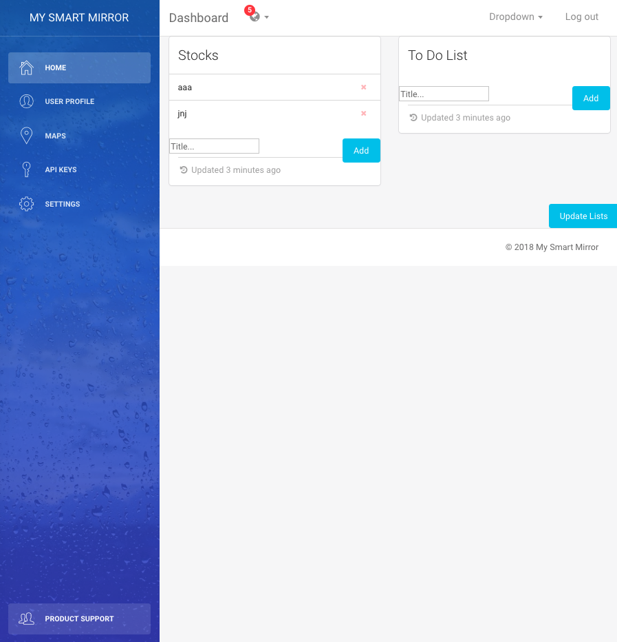
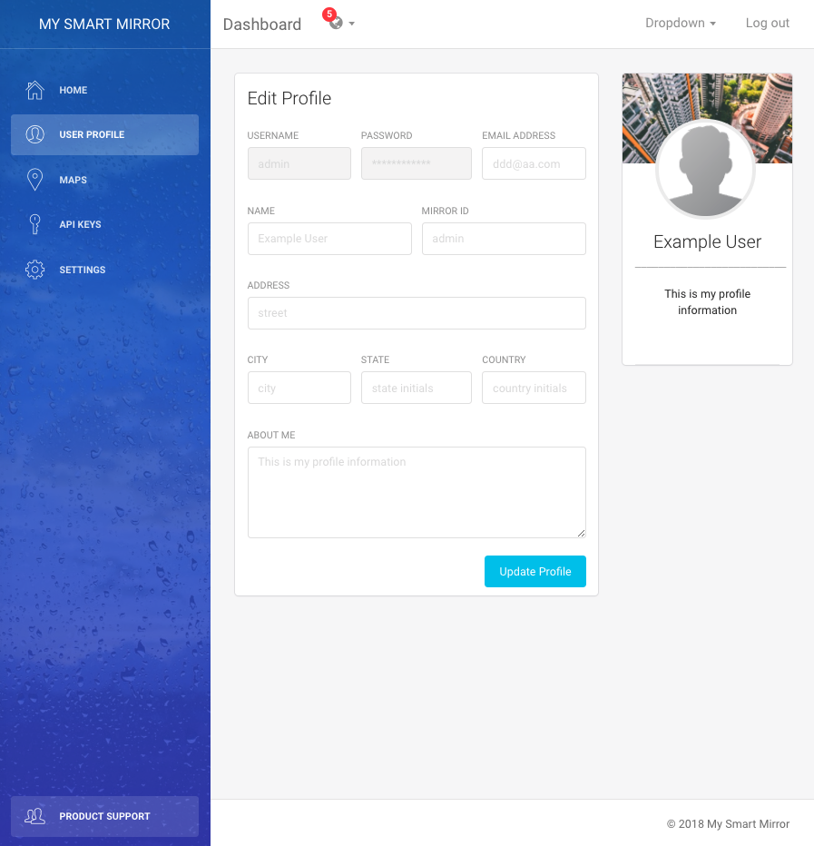
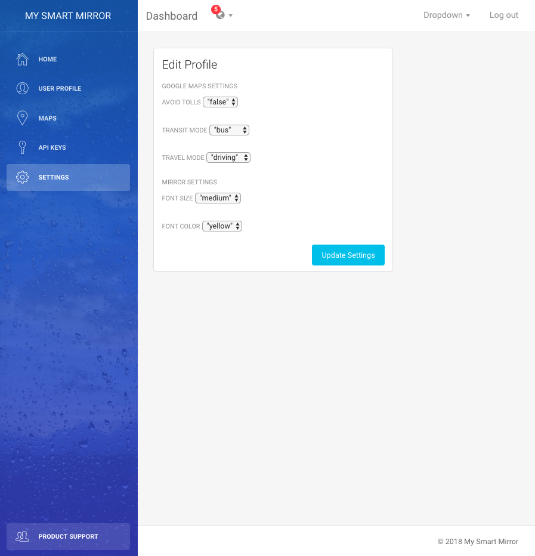
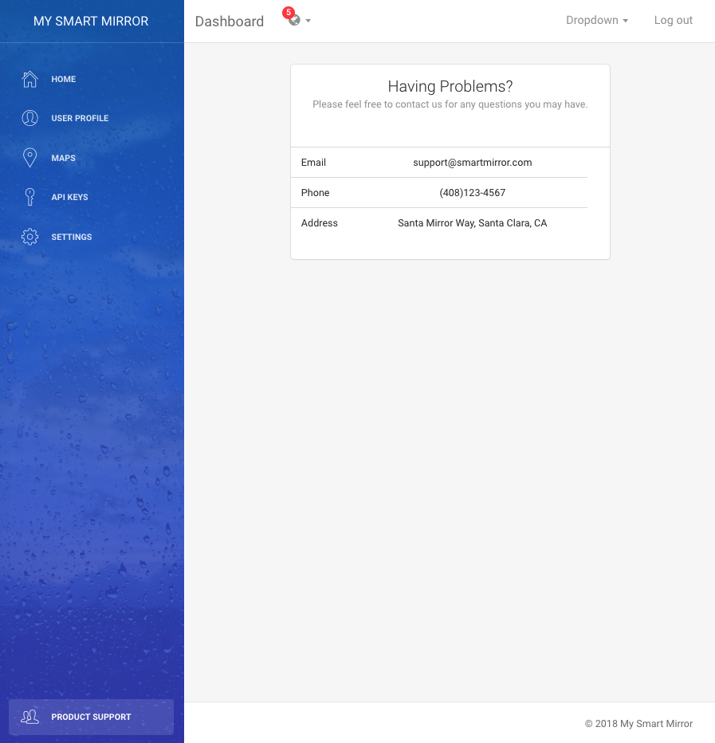
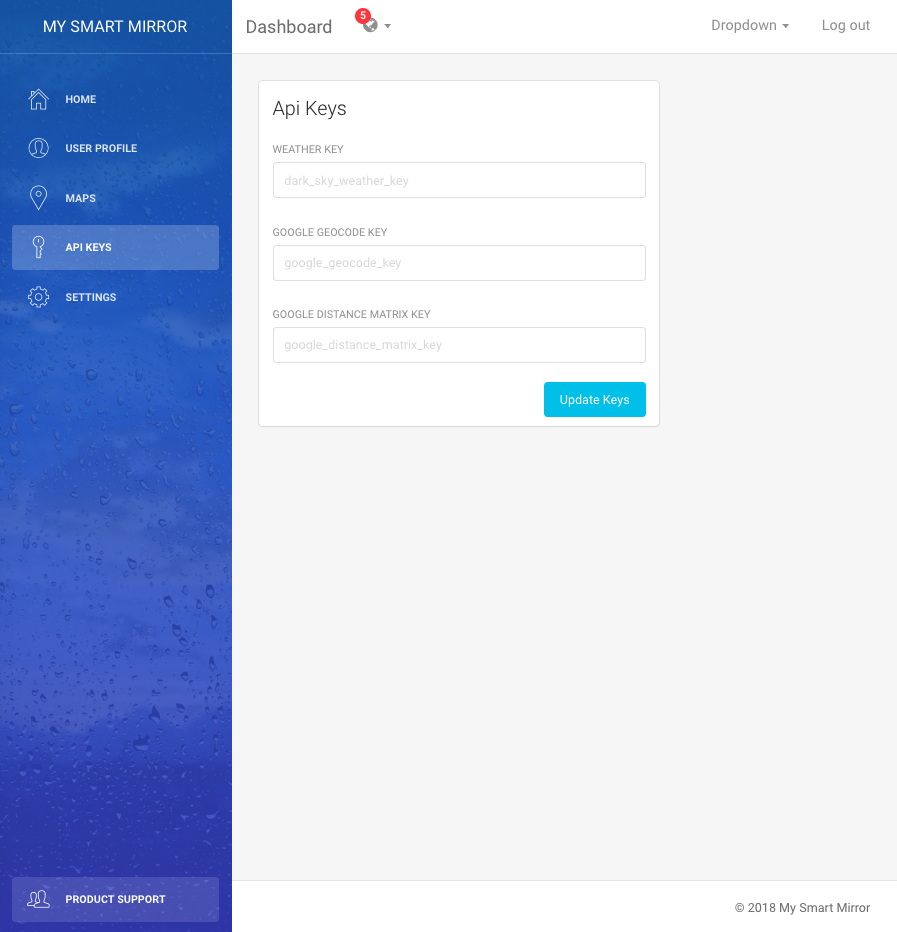
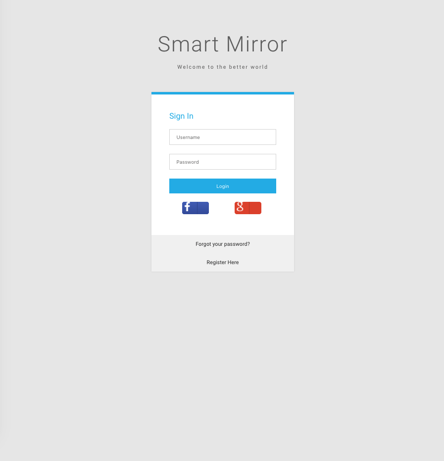
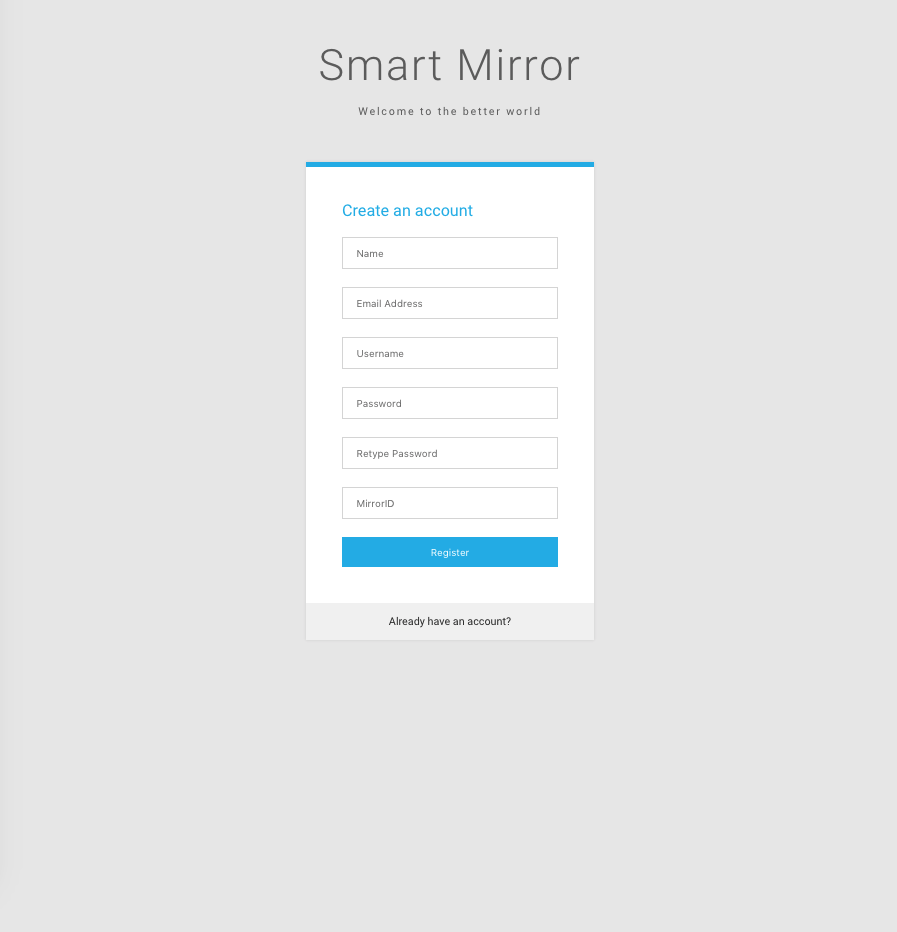

# SmartMirrorServer

### Description
This web app is made for a user to update his or her preferences. It connects to a mongodb database, and uses express for authentication. 

### setup
Install node:
```
sudo apt-get purge nodejs npm
curl -sL https://deb.nodesource.com/setup_7.x | sudo -E bash -
sudo apt-get install -y nodejs
sudo apt install npm
```
Install mongodb
```
sudo apt-get install mongodb
```

To Start Mongo
```
sudo service mongodb start
```

### Install Heroku Command Line Tools On Ubuntu
```
sudo apt-get install software-properties-common
$ sudo add-apt-repository "deb https://cli-assets.heroku.com/branches/stable/apt ./"
$ curl -L https://cli-assets.heroku.com/apt/release.key | sudo apt-key add -
$ sudo apt-get update
$ sudo apt-get install heroku
```

### Setting Up Facebook Auth. Refer to Guide
http://passportjs.org/docs/facebook

```
npm install -g passport-facebook --save
npm install -g passport-google-oauth --save
npm install -g nodemon
```

### React Version
React version got backlogged. Only the frontend is done.


### Screenshots






